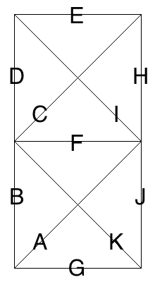

# Mirror Rune V2
 

A Python Project to generate image sheets of all possible valid combinations that fit the runic parameters

Check out [here](https://github.com/chrisfaux95/Dynamic-Rune-Generator) for the current and more flexable (WIP) versions
